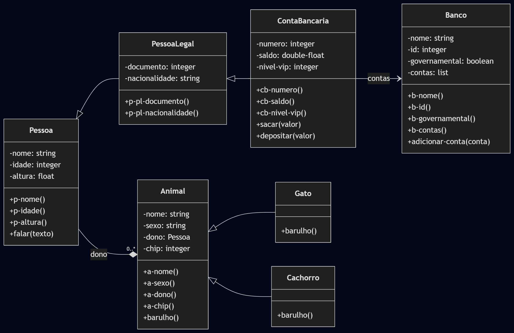

# POO: Common Lisp
#### Bernardo BC

---

## O que é o Common Lisp?
O CL é um dialeto da linguagem Lisp, criado como um sucessor padronizado e melhorado ao Maclisp. É uma linguagem general-purpose, e é usado em paradigmas procedurais, funcionais, de IA e programação orientada a objetos. Sua sintaxe é bem única, considerando que é uma de poucas linguagens que não se basearam na filosofia da sintaxe do B/C, utilizando S-expressions.

---

## Exemplos
```lisp
(sort (list '(9 A) '(3 B) '(4 C)) #'< :key #'first)
                      ; Retorna ((3 B) (4 C) (9 A))
```
```lisp
(defun square (x)
    (* x x)) ; Define função

(square 3) ; Retorna 9
```

---

# Diagrama


---

# Classes
```lisp
(defclass pessoa ()
    ((nome :initarg :nome :type string :accessor p-nome)
    (idade :initarg :idade :type integer :accessor p-idade)
    (altura :initarg :altura :type float :accessor p-altura)))

(defclass pessoa-legal (pessoa) 
    ((documento :initarg :documento :type integer :accessor p-pl-documento)
    (nacionalidade :initarg :nacionalidade :type string :accessor p-pl-nacionalidade)))

(defclass conta-bancaria (pessoa-legal) 
    ((numero :initarg :numero :type integer :accessor cb-numero)
    (saldo :initarg :saldo :type double-float :accessor cb-saldo)
    (nivel-vip :initarg :nivel-vip :type integer :accessor cb-nivel-vip)))
```

---

```lisp
(defclass banco () 
    ((nome :initarg :nome :type string :accessor b-nome)
    (id :initarg :id :type int :accessor b-id)
    (governamental :initarg :governamental :type boole :accessor b-governamental)
    (contas :initarg :contas :initform nil :accessor b-contas)))

(defclass animal () 
    ((nome :initarg :nome :type string :accessor a-nome)
    (sexo :initarg :sexo :type string :accessor a-sexo)
    (dono :initarg :dono :type pessoa :accessor a-dono)
    (chip :initarg :chip :type integer :accessor a-chip)))

(defclass gato (animal) ())
(defmethod barulho ((gato gato))
    (format t "~a esta miando~%" (a-nome gato)))
    
(defclass cachorro (animal) ())
(defmethod barulho ((cachorro cachorro))
    (format t "~a esta latindo~%" (a-nome cachorro)))

(defmethod total-saldo ((banco banco))
  (let ((total 0.0))
    (dolist (conta (b-contas banco))
      (setf total (+ total (cb-saldo conta))))
    total))
```

---

# Métodos

```lisp
(defmethod sacar ((conta conta-bancaria) valor)
    (if (>= (cb-saldo conta) valor)
        (progn 
            (setf (cb-saldo conta) (- (cb-saldo conta) valor))
            (format t "Saque de ~a realizado na conta ~a. Novo saldo: ~a~%" 
                                                                        valor 
                                                                        (cb-numero conta) 
                                                                        (cb-saldo conta)))
            (format t "Saldo insuficiente~%")))

(defmethod depositar ((conta conta-bancaria) valor)
    (setf (cb-saldo conta) (+ (cb-saldo conta) valor))
    (format t "~a depositado a conta ~a. Novo saldo: ~a~%" valor (cb-numero conta) (cb-saldo conta)))

(defmethod barulho ((animal animal))
    (format t "~a quer atencao~%" (a-nome animal)))

(defmethod falar ((pessoa pessoa) &rest texto)
  (format t "~a diz: ~{~a~^ ~}~%" (p-nome pessoa) texto))
```

---

# Instâncias
```lisp
(defvar *senua* (make-instance 'conta-bancaria
                                :nome "Senua"
                                :idade 21
                                :altura 1.70
                                :documento 193017
                                :nacionalidade "Brasil"
                                :numero 193017
                                :saldo 0.0
                                :nivel-vip 3))

(defvar *mimi* (make-instance 'gato 
                                :chip 3247838 
                                :sexo "Masculino"
                                :nome "mimi"
                                :dono *senua*))
```

---

```lisp
(defvar *mel* (make-instance 'cachorro 
                                :chip 223322 
                                :sexo "Feminino"
                                :nome "mel"
                                :dono *senua*))
                                
(defvar *oli* (make-instance 'animal 
                                :chip 438923
                                :sexo "Masculino"
                                :nome "oli"
                                :dono *senua*))

(defvar *mainBanco* (make-instance 'banco
                                :nome "Putobras"
                                :id 149
                                :governamental t))
```

---

# Main

```lisp
(adicionar-conta *mainBanco* *senua*)
(format t "Saldo total do banco ~a: ~a~%" (b-nome *mainBanco*) (total-saldo *mainBanco*))
(depositar *senua* 500.0)
(format t "Saldo total do banco ~a: ~a~%" (b-nome *mainBanco*) (total-saldo *mainBanco*))
(sacar *senua* 20.0)

(format t "Contas no banco ~a:~%" (b-nome *mainBanco*))
(dolist (conta (b-contas *mainBanco*))
    (format t "- Conta ~a de ~a tem saldo ~a~%" 
                                (cb-numero conta) 
                                (p-nome conta) 
                                (cb-saldo conta)))

(barulho *mimi*)
(barulho *mel*)
(barulho *oli*)
(falar *senua* "ola")
```

---

# Output
```
Conta 193017 adicionada ao banco Putobras
Saldo total do banco Putobras: 0.0
500.0 depositado a conta 193017. Novo saldo: 500.0
Saldo total do banco Putobras: 500.0
Saque de 20.0 realizado na conta 193017. Novo saldo: 480.0
Contas no banco Putobras:
     Conta 193017 de Senua tem saldo 480.0
mimi esta miando
mel esta latindo
oli quer atencao
Senua diz: ola
```